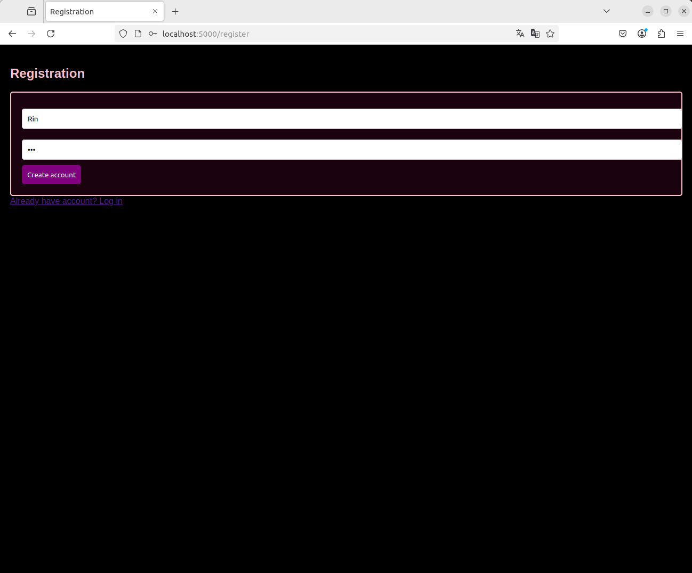
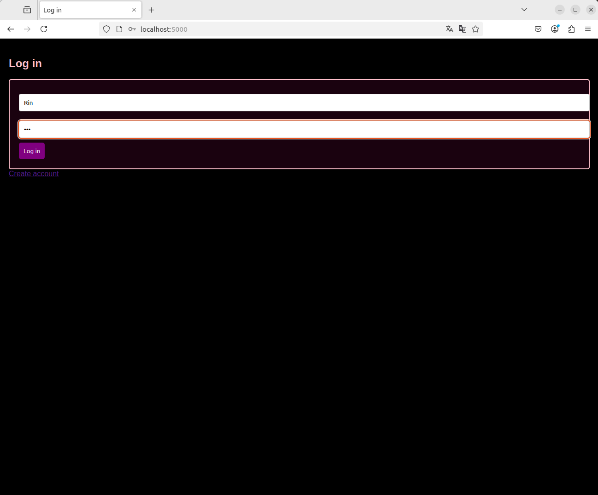
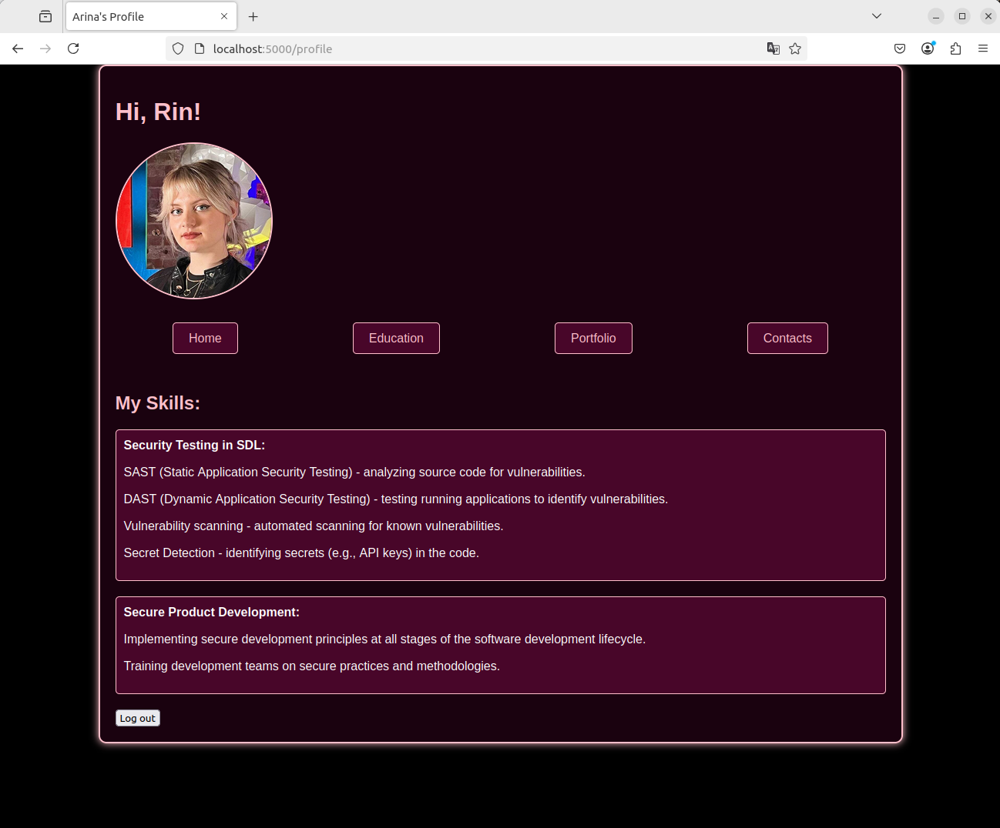

# Authentication & Databases

To run the app:
```
python3 app.py
```
Running on http://127.0.0.1:5000

A Flask application was created, including routes for authorization, displaying the profile and leaving the system.

The user is given the opportunity to register and log in to the system, after that his name is stored in the session and displayed on the profile page. 

The user has no acces to profile page without authorization.

Log in is unavailable for unregistered users.

The functionality of the exit from the system, which deleys the user's name from the session and redirects to the main page.

Registration.


Authentification.


Access to page of authorirized user Rin. Log out button is on page down.
